# Management App

## Quick Start

### Get help when you need it

Be sure to ask for help if you need it; click `help` in the left-hand menu. 


If you don't see the menu, you're on mobile. Click the `hamburger` to  roll the sidebar out.



To dismiss, _**click**_ _skip tutorial_ or _anywhere outside of the walk-through bubble_.


### Basic Usage

Our application offers two main introspective functions:

* Relational industry-business dynamics
  * How _has_ _your business performed_ versus peers? 
  * How _is_ _your business performing_ versus peers, today? 
  * How _will_ _your business perform_ versus peers, tomorrow?
* Business-specific capital allocation decisions
  * Given the dynamics above, what should I do _today_, _tomorrow, and the next day?_

#### Know the industry and your artists

See how _your aggregate portfolio_ is performing against your peers' portfolios by monitoring the `industry status bar`. 

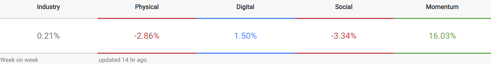


This automatically updates when our incoming data streams update, usually overnight and the comparison time range is based on your time-horizon selection.


Monitor each artists' status bar to keep tabs on performance across verticals that matter to you and to each artist, _automagically_. 

#### Glean future performance 

Using the _interactive_ consumption time series graphs, drill down your expected performance over your selected time-horizon. 

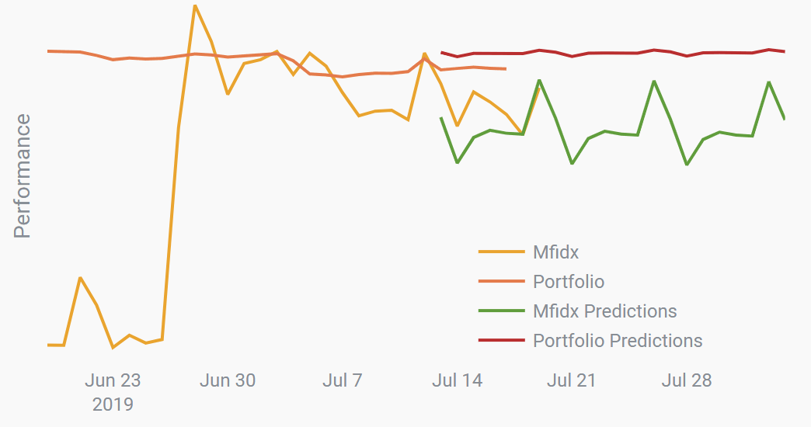

You're a real pro:👓 @ the past, present, and future centered around _your business_.

#### Allocate your resources efficiently

> _One of the great mistakes is to judge policies and programs by their intentions rather than their results._
>
> **Milton Friedman**

Musicfox displays an asset allocation specific to your book of business, individual artist dynamics, and a holistic view of the industry. 

See where you _should_ be going and what we predict that will do for you, and your artists. Ever wonder what impact John Mayer's summer '19 tour has on _your portfolio_ ?

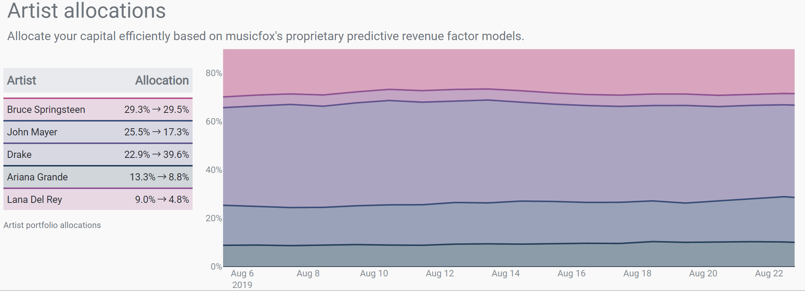


All of our graphs are dynamic: _zoom_, _drag_, _click_, _whatever_! _**Double click**_ inside a graph to return it to the original state.


#### Risk to your ♥'s desire

You control the level of fluctuation in your portfolio. Yep, that's right.

_You're in control._

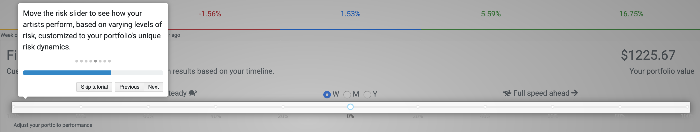


You set the risk parameter here. As such, you'll see your portfolio move within the portfolio dynamics display, below.


#### Focus on your artists

See your artists in a new light. Compare consumption factors across your portfolio _and_ the industry, while Musicfox monitors and recommends marketing verticals.


We optimize consumption marketing recommendations based on each individual artists' competitive quantitative dynamics _within the context of your holistic book of business_.


####  Artist Overview

Keep tabs on each portfolio artist and know how they're doing to peers, in a single glance. Catch fan highlights, real-time socials, and top-generating playlists in the context of what matters

#### Performance and Statistics

Dive deep into your artists' past, present, and future performance dynamics. 

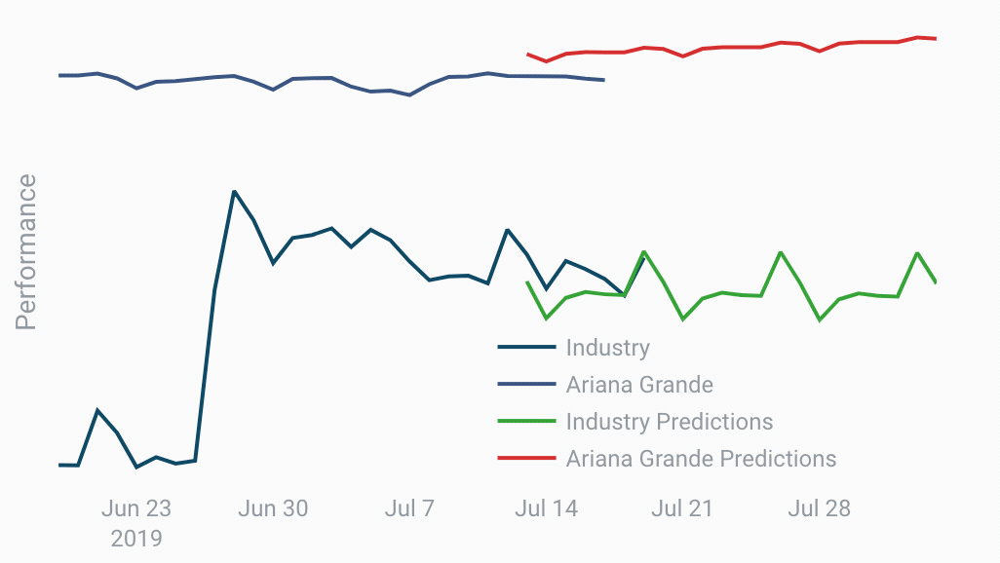

The **stats tool** can help to mobilize those unique money-making differences that your most successful artists possess.

> Compare Drake's past returns with the industry. 
>
> See how many observations are centered slightly positively around zero for Drake, versus the industry? Look at you, 🤓!

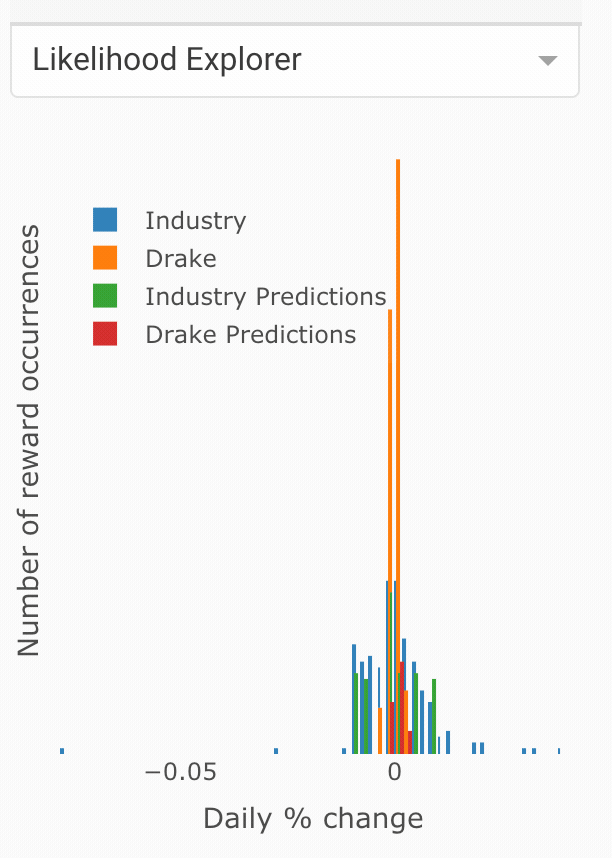

#### Todos

Okay, let's be honest: you're going to like it when we tell you what to do. Seriously. 

We automatigically generate each artist's _low-hanging-fruit_ verticals so you can focus on your job making things sing. Take the guesswork out of your next move and further hone your management expertise. 

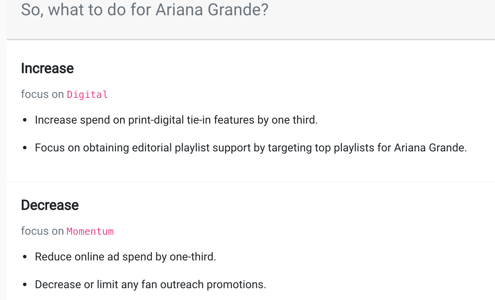

## Management App Features

A somewhat exhaustive overview of the features found at app.musicfox.io.

### Concepts: Risk, Return, and Everything Between 

We're changing this music business game and that means you'll need to reacquaint some of your management skills. 

> Read the concepts below and you'll manage your book of business like Warren Buffett runs Berkshire Hathaway.

#### Risk 🛡 

At the core of Musicfox sits _risk_. It's a funny concept, and one most of us deeply understand and misunderstand, at once. Risk can be defined in many different ways; here, we'll see it in two lights, quantitatively:  

1. volatility, or how much something moves around, over time, and,
2. loss-aversion, or a tangible dollar amount beneficial parties are willing to lose in order to gain some tangible dollar amount.


_Volatility_: we typically define this as the square-root of a time-series' variance. This is synonymous with $$\sigma$$ or standard deviation. 

_Loss_-_aversion_: on average, how much is the average professional for your average artist type willing to lose, in order to continue operations?


#### Return 🚀 

As you may have guessed, the risk concept we dove into above has little meaning without its complement, return or reward. 

This is the one we all understand: stay away from the cookie jar and mom gives you another cookie. Get involved early and she puts you in time-out. 

#### Diversification

#### Asset Allocation

#### Probability

### Page Layout

### Menu bar 

#### Dashboard

#### Reports

#### Settings

#### Help

### Navigation bar

#### Hamburglar 

#### Search

#### Logout

### Industry Overview

#### Artist Search

#### Statusbar

#### Risk Slider & Portfolio Value

#### Risk-Reward Optimization

#### Consumption Over Time

#### Artist Allocation & Consumption

### Artist Overview

#### Artist Name & Photo

#### Popular Tracks

#### Listen Locales

#### Top Playlists

#### Tweets

#### Artist Status Bar

#### Performance Recommendations

#### Complex Stats

#### Todos

## User Management

A summary overview of user settings.

### Authentication

Settings related to logging into and out of Musicfox.

### `Login`

To login, you'll need a Google Account. 

Get one @ [myaccount.google.com](https://myaccount.google.com/)

Afterwards, login is super simple:

* _**Go to**_ [musicfox.io](https://musicfox.io)
* _**Click**_ `App Login`

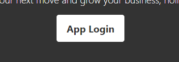

* _**Login**_ to Google

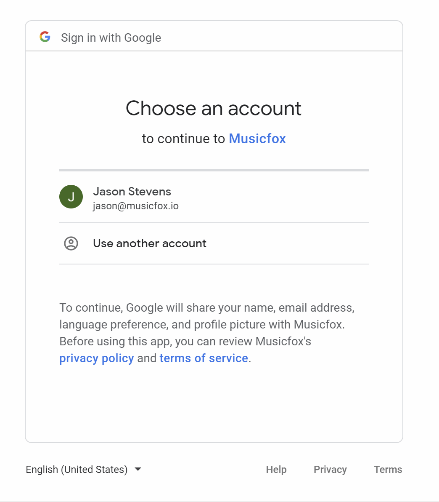

### `Logout`

To logout, click your user profile image in the upper right-hand corner of the application. This will return you to musicfox.io. 

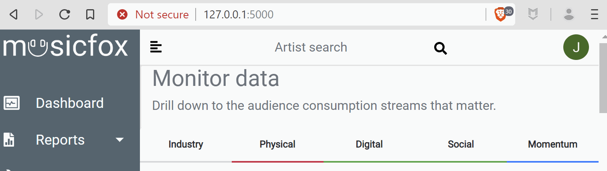

### Google Accounts

We use Google as our sole authentication provider for a multitude of reasons, though leveraging Google's credential security being the primary concern. 

Signing up for a [Google Account](https://myaccount.google.com) is free and you likely already have one, anyways.

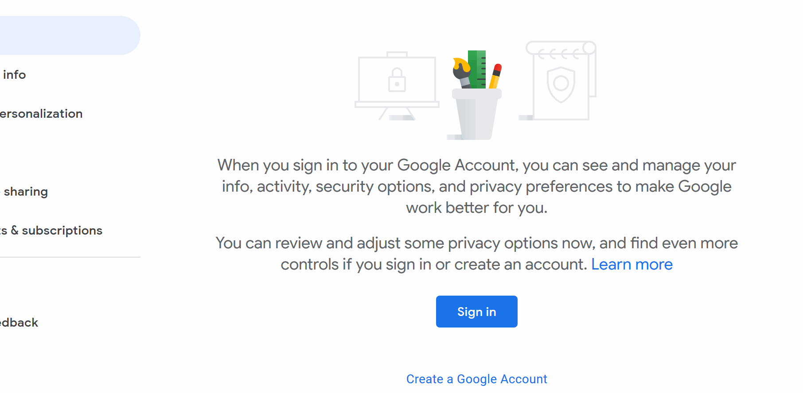


 Passwords are critical. At Musicfox we recommend you use a long password \(15+ characters\) with multiple character types.

Accomplish this by using your favorite sentence, e.g.  "I  gained superpowers after using Musicfox."

Okay, seriously, don't use that one. But you get the point.


