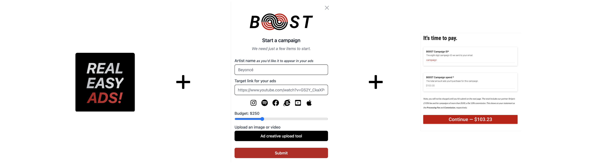

# About b00st.com

Here are some quick links to frequently referenced questions about [b00st.com](https://b00st.com).

* [What is b00st.com?](./#what-is-b00st.com)
* [What does b00st.com do?](./#what-does-it-do)
* [How does it work?](./#how-does-it-work)
* [How much does it cost?](./#how-much-does-it-cost)
* [How to get started?](./#how-to-get-started)

## What is b00st.com?

b00st.com is a supercharged online promotion tool that artists and their teams use to advertise online effectively, for a fraction of the cost.


B00ST makes online ads simple while using the most advanced technology to benefit artists.


## What does it do?

B00ST runs ads on behalf of artists across social channels to promote their brand and content.

### What can be promoted?

**B00ST is designed to promote any target link or channel**. For example, to grow YouTube enter a link to a video or YouTube channel. To grow Spotify enter a link to a profile/song/album on Spotify, and so forth. **From the info provided our software will devise the mathematically optimal way to promote your target destination.**


B00ST removes uncertainty and maximizes results by updating campaign elements in real-time to save time and money.


### Where are ads published?

Ads are published on Instagram, Facebook, Google, YouTube, & TikTok (alpha). **To enhance security for artists and simplify the process we run dark posts from our B00ST channels that promote artists' content**. Artists don't have to give up access to their socials and only pay when fans click on their content and land on their properties. Win-win!


Our software starts broad and narrows down the elements (channels, budget, creative, detailed targeting, etc.) that lead to the best results for each campaign.


### What does an example ad look like?

Below is an example of an ad promoting our own software. B00ST uses the creative you provide alongside copy and call-to-action options created by AI, custom to your campaign.

## How does it work?

### Real fans, not bots

**B00ST ads target real fans** who make active decisions to perform an action, like opening Spotify and listening to an artist’s music. Our tech detects and minimizes bots (the web is full of them) to deliver artists real eyeballs on their content.

### The process, in detail

Geek alert 😁! **B00ST algos and software are geared to save artists money while achieving optimal return on investment (= bang for your buck)**.

### How does targeting work?

It starts with analyzing social channels for each artist, the industry, and that artist's peers, over time, to compose the initial ad buying recommendations. B00ST draws from tons of different data sources such as music consumption, touring activity, and socials to accurately build high-value target groups for each artist.

### Where is the money spent?

B00ST is plugged into Google, YouTube, Instagram, and Facebook - more platforms coming soon. Deep inside this portion lies mathematical portfolio allocation and asset valuation software, which makes data transformations and produces the ad allocation set.

### How does optimization work?

Once the initial allocations are fixed, we perform A/B testing via regression analysis to determine what demo, creative, and copy produces the optimal ROI per channel at the respective moment in time.

After a campaign launches the software regularly updates all campaign elements. We call this Dynamic Tactical Allocation, which helps produce optimal ad spends through time.

## How much does it cost?

We charge a simple 10% fee of the ad budget.&#x20;

Good news is that we waive our fee for one campaign up-to $500 in ad spend, every month, which means that you can effectively use our software for free.&#x20;

If you are thinking about running a lot of campaigns for different artists on a regular basis, please check out our [pro tier](https://b00st.com/#pricing) or drop us an email.


Our payment partner Stripe charges a card processing percentage and a small ($.30) fee for all payments. Invoices are due before campaign launch. \
\
:sparkles:**Pro plan** subscribers have the option of fee-free wires and ACH transfers.



Visit our [Pricing page](https://b00st.com/#pricing) for more details.&#x20;


## How to get started?

### As simple as a button click: [b00st.com](https://b00st.com)


Top of the line robots and algos + our team make sure every campaign detail is executed expertly with lightning speed.

