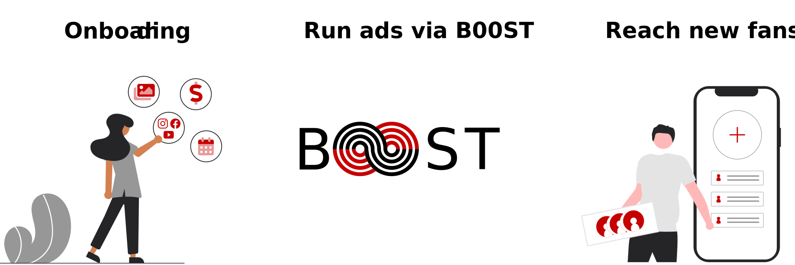

# How does it work?

B00ST runs ads on behalf of artists across social channels to promote their brand and content. 

## Where are ads published?

Ads are published on Instagram, Facebook, Google, and YouTube. **To enhance security for artists and simplify the process we run dark posts from our B00ST channels that promote artists content**. Artists don't have to give up access to their socials and only pay when fans click on their content and land on their properties. Win-win! 


B00ST works best when our software can start broad and narrow down what elements \(channels, budget, creative, detailed targeting, etc.\) lead to the best results for each campaign.


## What can be promoted?

Artists can select a list of channels and content to focus on for every campaign. B00ST takes it from there and runs ads geared for maximum results and lowest costs. 


B00ST removes uncertainty and maximizes results by updating campaign elements in real-time to save time and money.


