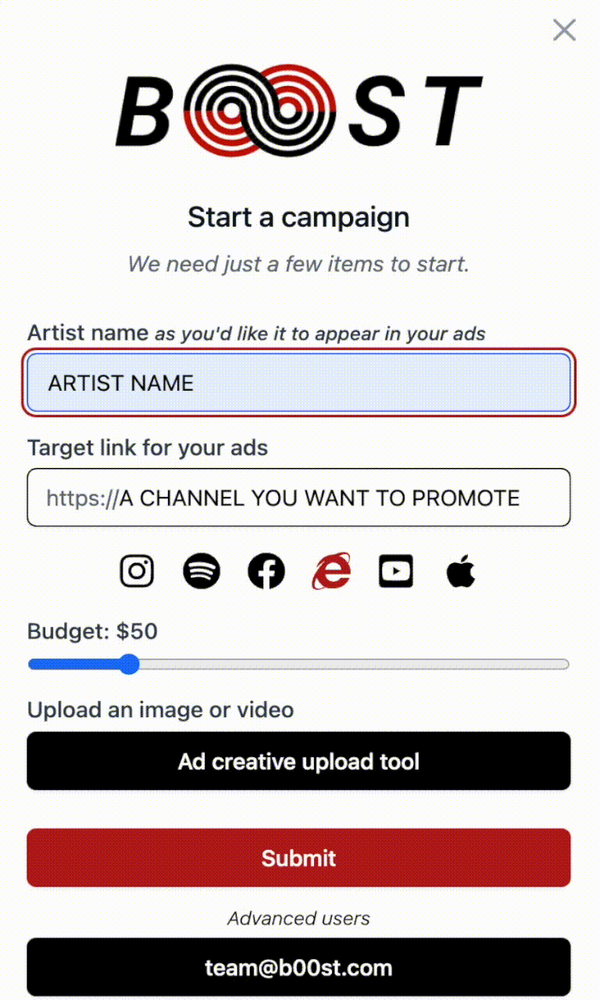

# Start a new campaign

To get started, sign in on [b00st.com](https://b00st.com/) and click the B00ST button on the homepage

Provide campaign details. 

1. Artist Name
2. Target link: this can be **ANY link you want to promote and grow**, e.g. a social media platform, song/album on a streaming service, artist website, artist merch store, a single show or an entire tour, etc. 
3. Upload an asset/creative. Square 1080x1080 pixels, or Vertical 1080x1920 work best. 

4. Click submit and let B00ST take care of the rest.  

Advanced users, sign in [b00st.com](https://b00st.com/) and email [team@b00st.com](mailto:team@b00st.com?body=Start%20a%20new%20campaign.) with something like “_start a new campaign_” in the message. Our software will take it from there and get your campaign started in no time. It's that simple!


Pro tip: you can omit email subject lines.


During the set up process our software learns about the artist and objective and sets up A/B tests. 

