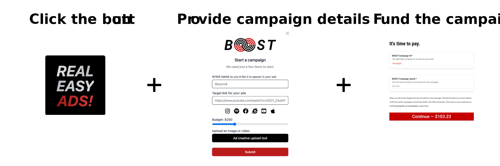

# Start a new campaign

To get started, sign in on [b00st.com](https://b00st.com/) and click the B00ST button on the homepage

Advanced users, sign in [b00st.com](https://b00st.com/) and email [team@b00st.com](mailto:team@b00st.com?body=Start%20a%20new%20campaign.) with something like “_start a new campaign_” in the message. Our software will take it from there and get your campaign started in no time. It's that simple!


Pro tip: you can omit email subject lines.


During the set up process our software learns about the artist and objective and sets up A/B tests. 

