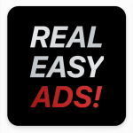

# Start a new campaign

To get started, sign in on [b00st.com](https://b00st.com) and click the B00ST button on the homepage

Provide campaign details.&#x20;

1. Artist Name
2. Target link: this can be **ANY link or channel you want to promote and grow**, e.g. a social media platform, song/album on a streaming service, artist website, artist merch store, a single show or an entire tour, etc.&#x20;
3. Upload an asset/creative. Square 1080x1080 pixels, or Vertical 1080x1920 work best. Our AI has you you covered on copy.&#x20;

4\. Click submit and let B00ST take care of the rest. &#x20;

.png>)

