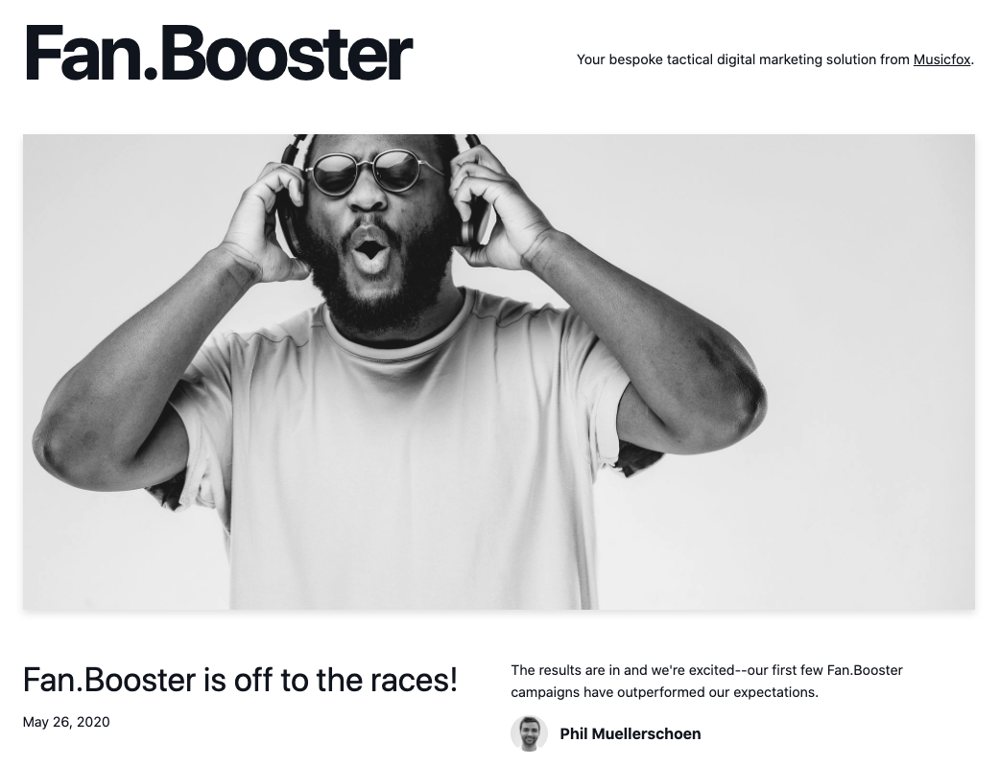
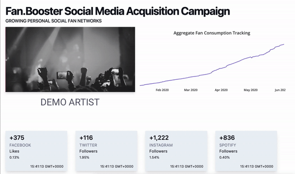
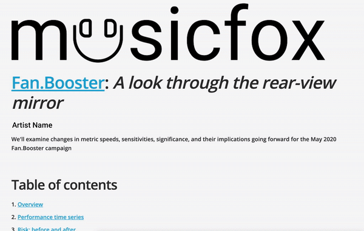

# Fan.Booster

### Table of contents:

1. [Overview](https://docs.musicfox.io/#overview)
2. [Campaign Page Layout](http://fan.booster.musicfox.io/#campaign-page-layout)
3. [User Management](http://fan.booster.musicfox.io/#fb-user-management)

### Overview

Fan.Booster is Musicfox's solution to transform passive viewers and listeners into loyal and marketable followers. Musicfox applies proprietary algorithms to dynamically allocate funds across platforms in real-time, thus creating a bespoke way to optimize and prioritize follower acquisition ad spend like never before.

Fan.Booster consists of three distinct components. 

#### \#1 Homepage

[https://fan.booster.musicfox.io](https://fan.booster.musicfox.io/) is where management publishes updates and new features for the Fan.Booster community. 


If you are a Fan.Booster client you will be able to log in to your portal from the homepage.


#### \#2 Campaign portal

Each campaign has an individually curated workspace - the portal. Companies with more than one campaign will be able to access each via the company's campaign portal. 


The portal page will be updated periodically with new data, campaign tentpoles, and noteworthy findings from Musicfox management. 


#### \#3 Reporting 

Data science and artist valuation is at the core of what Musicfox does. Each campaign has a dedicated reporting page. 


This page will be published at the end of each campaign cycle and can be shared via secret link.


### Campaign Page Layout 

#### Artist Name

**Consumption tracking**

**Spend tracking**

**Upcoming & Completed Work**

**Project Goals**

**Campaign Breakdown**

Trends

Interesting Facts

 

### User Management 

