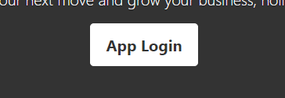
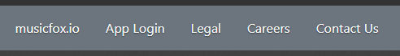
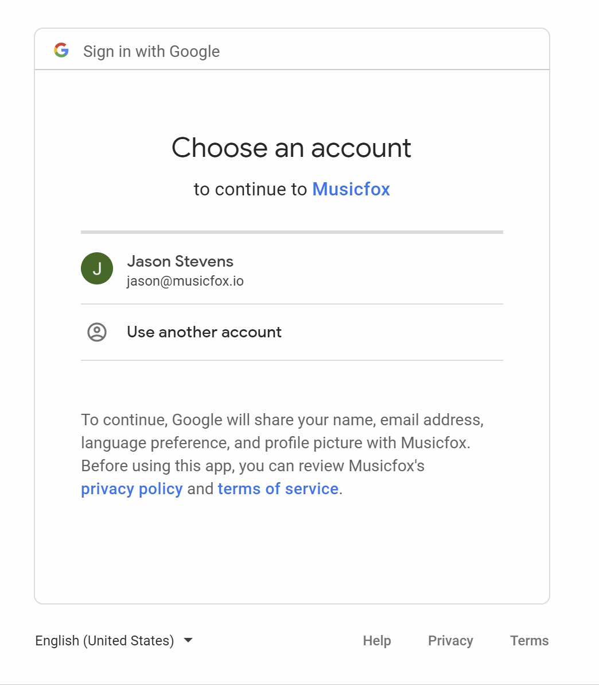
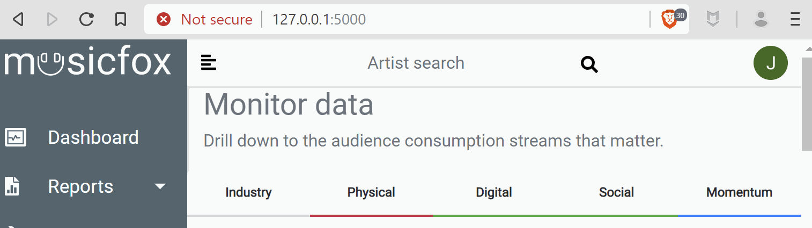
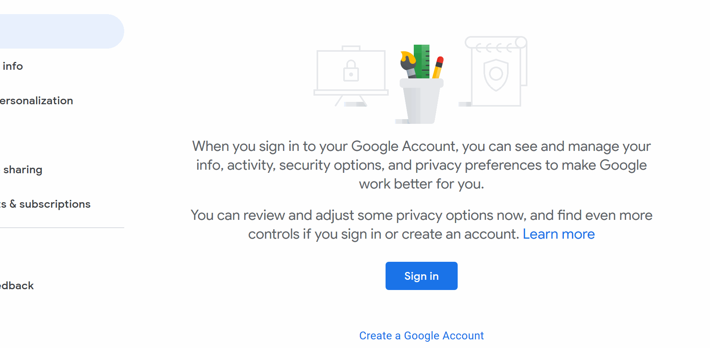

# User Management

## Authentication

Settings related to logging into and out of Musicfox.

### `Login`

To login, you'll need a Google Account. 

Get one @ [myaccount.google.com](https://myaccount.google.com/)

Afterwards, login is super simple:

* _**Go to**_ [musicfox.io](https://musicfox.io)
* _**Click**_ `App Login`

* _**Login**_ to Google

### `Logout`

To logout, click your user profile image in the upper right-hand corner of the application. This will return you to musicfox.io. 

### Google Accounts

We use Google as our sole authentication provider for a multitude of reasons, though leveraging Google's credential security being the primary concern. 

Signing up for a [Google Account](https://myaccount.google.com) is free and you likely already have one, anyways.


 Passwords are critical. At Musicfox we recommend you use a long password \(15+ characters\) with multiple character types.

Accomplish this by using your favorite sentence, e.g.  "I  gained superpowers after using Musicfox."

Okay, seriously, don't use that one. But you get the point.


